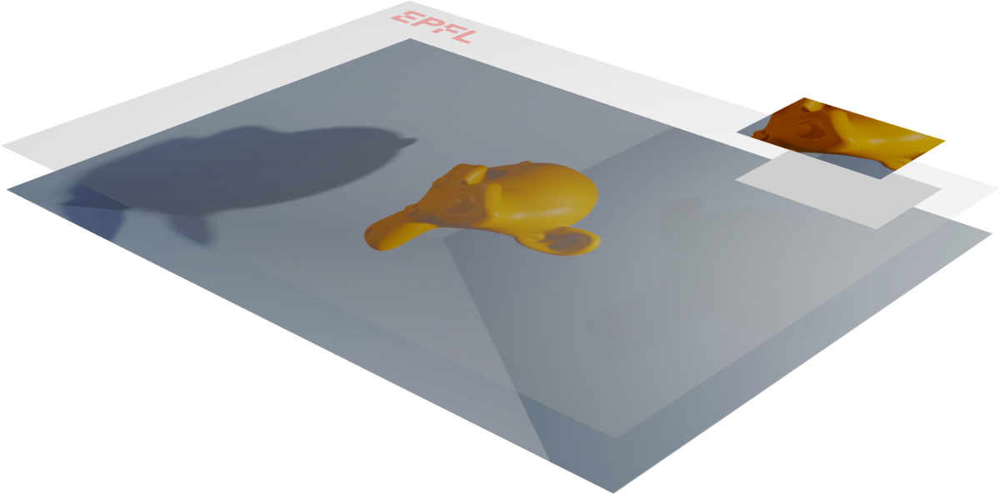

# video-batch-editor
Electron App to edit videos in batch mode

## Development

### `npm run electron:dev`

Runs the Electron app in the development mode.

The Electron app will reload if you make edits in the `electron` directory.  
You will also see any lint errors in the console.

### `npm run electron:build`

Builds the Electron app package for production to the `dist` folder.

Your Electron app is ready to be distributed!
